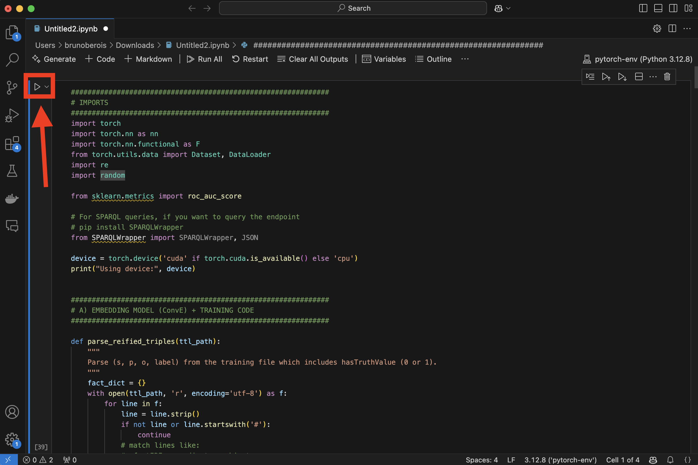

# FoKG-Alfakes-Worona-Berois

# Fact-Checking Engine with Knowledge Graphs

This project is a fact-checking engine that assigns a veracity value between 0 (false) and 1 (true) for a given fact using a reference knowledge graph. The output is evaluated through the GERBIL platform to determine the Area Under Curve (AUC) for the ROC curve. Achieving an AUC above 0.6 on the test dataset is the project’s success criterion.

## Project Approach

The project leverages the following key steps:

### 1.	Data Preprocessing:

- The training data, provided in RDF format, is parsed and analyzed.

- Statements and their associated veracity values are extracted for use in the model.

### 2.	Knowledge Graph Integration:

- A SPARQL endpoint is queried to retrieve relevant facts and properties from the reference knowledge graph.

- These queries help establish relationships between entities and verify facts.

### 3.	Feature Engineering:

- Semantic similarity, entity connectivity, and predicate significance are calculated to generate features for each fact.

- External libraries and RDF processing tools are used for feature extraction.

### 4.	Model Training:

- A machine learning model (e.g., logistic regression, decision tree) is trained using the features generated from the training data.

- The veracity score is modeled as a probability output between 0 and 1.

### 5.	Evaluation and Output Generation:

- Test data is processed similarly to the training data.

- The model predicts veracity scores, and results are formatted in RDF .ttl format, ready for submission to the GERBIL platform.

## Project Structure

### Data Processing:

- Prepares the RDF data for analysis and feature extraction.

### SPARQL Queries:

- Extracts relevant information from the reference knowledge graph.

### Model Training:

- Contains scripts for training the fact-checking model and saving the trained model.

### Result Generation:

- Formats predictions into the required .ttl format for GERBIL evaluation.

## Prerequisites

Before running the project, ensure you have the following installed:

- Python (preferably 3.8)

- PyTorch

- Libraries:
    * rdflib: For parsing and querying RDF data.
    * pandas: For handling tabular data.
    * scikit-learn: For machine learning model training.
    * SPARQLWrapper: For querying the knowledge graph.

## How to Execute

### 1. Prepare the Environment:

- Ensure the training and test RDF datasets are placed in the /data folder.

- Update SPARQL endpoint URLs in the configuration section of the script if needed.

### 2. Run the Script

You can run the script with Visual Studio Code as shown in the picture

### Results

- The output file result.ttl is generated in the root directory.

- Submit the file to GERBIL following the instructions in the project description.